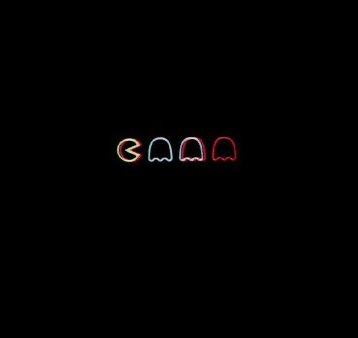

<!-- header -->

  Man eats man!

<!-- 

  

 -->

---

<!-- content -->

  <table width="100%">
    <tr>
      <td width="25%" valign="middle" align="left">
        <i style="color: #666">If there's a future, it is now.</i>
      </td>
      <td width="75%">
        
      </td>
    </tr>
  </table>

 

---

  

<!-- footer -->
<!-- 

  

 -->

<!-- roughwork -->

<!-- > [!NOTE]
> **Blue Background:** Use this for helpful tips or general information.

> [!TIP]
> **Green Background:** Perfect for showing things you have successfully built.

> [!IMPORTANT]
> **Purple Background:** Great for drawing attention to your key pinned projects.

> [!WARNING]
> **Yellow Background:** Use this to show things you are currently fixing or learning.

> [!CAUTION]
> **Red Background:** Good for fun "do not click" links or strong warnings. -->

<!-- footer -->

---

<!-- citrcles -->
<!-- <svg width="200" height="200" xmlns="http://w3.org" style="background-color: #222222;">
  <circle cx="100" cy="100" r="50" fill="#7f00ff" />
</svg> -->

<!-- 

  <svg width="150" height="150" xmlns="http://w3.org">
    <defs>
      <linearGradient id="circleGradient" x1="0%" y1="0%" x2="100%" y2="100%">
        <stop offset="0%" stop-color="#ff007f" />
        <stop offset="100%" stop-color="#7f00ff" />
      </linearGradient>
    </defs>
    <circle cx="75" cy="75" r="70" fill="url(#circleGradient)" />
    <text x="50%" y="53%" dominant-baseline="middle" text-anchor="middle" fill="#ffffff" font-family="Segoe UI, sans-serif" font-size="18" font-weight="bold">
      HI!
    </text>
  </svg>

 -->

  

