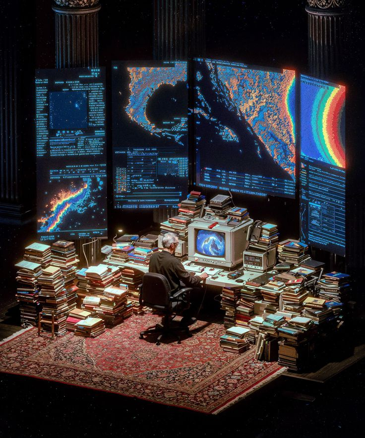

<!DOCTYPE html>
<html lang="en">
<!-- Main Wrap Structure to pull the content up seamlessly -->

  

 

  <!-- <table>
        <tr><td><h1>Hello World! 👾</h1></td></tr>
    </table> -->
  <table width="100%">
    <tr>
      <td width="25%" valign="middle" align="left">
        <i style="color: #666">If there's a future, it is now.</i>
      </td>
      <td width="75%">
        
      </td>
    </tr>
  </table>

 

  

