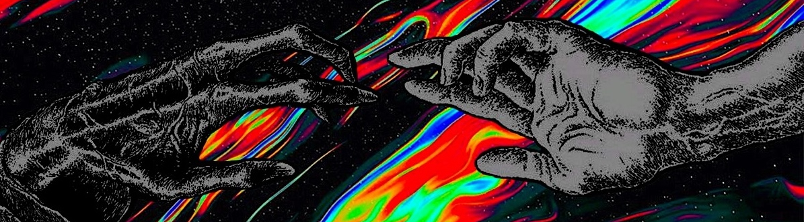

<!-- header -->

<blockquote>
  <b>Man loves ideas, that's why he created tech... but man eats man, and that's why he loves tech.</b>
</blockquote>

---

<!-- content -->

  
  
  
  
  

<h1></h1>

 

<h3><ins>Hello, World!</ins> 👾</h3>

 
Meet <b><i>Mandeep</i></b>.
 
 
A self-taught programmer and a born problem solver.
He combines his love for art and technology to build systems that thrive on
elegant architecture and lead to an effortless user-experience.
 
 
Specialises in design and development of real-time agentic AI systems,
and high-capacity data processing systems. He aims to deliver value through software that
bring about a quality of life change in the society.

 
 
 
 
 
 

---

<h2><i>🏗️  Currently building...</i></h2>

  
  Inspired by my love for dogs and the quest to find order within chaos, Sniffer strives
  to be one a kind Pattern Intelligence System for stock market players.

Available on TradingView platform as an open-source research tool, Sniffer PRO is
being actively developed to offer a richer and a more holistic toolkit for
price-structure analysis and systematic decision making.

---

<!-- interest -->

  

> [!NOTE]
> **Blue Background:** Use this for helpful tips or general information.

> [!TIP]
> **Green Background:** Perfect for showing things you have successfully built.

> [!IMPORTANT]
> **Purple Background:** Great for drawing attention to your key pinned projects.

> [!WARNING]
> **Yellow Background:** Use this to show things you are currently fixing or learning.

> [!CAUTION]
> **Red Background:** Good for fun "do not click" links or strong warnings. -->

<!-- footer -->
