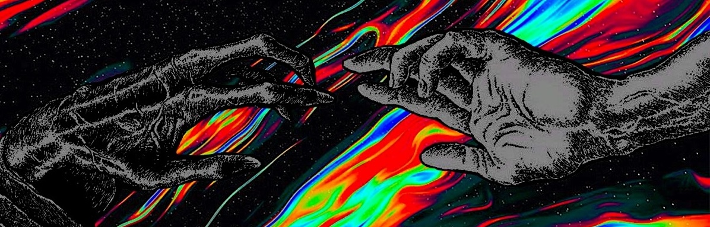
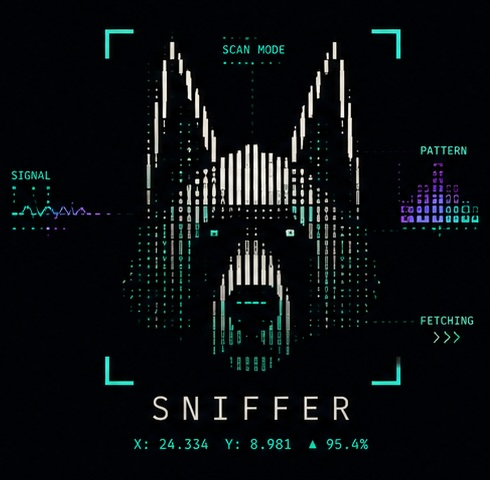

<!-- header -->

<blockquote>
  <b>Man loves ideas, that's why he created tech... but man eats man, and that's why he loves tech.</b>
</blockquote>

---

<!-- skills -->

  
  
  
  
  

---

<!-- intro -->

 

<h3><ins>Hello, World!</ins> 👾</h3>

 
Meet <b><i>Mandeep</i></b>.
 
 
A self-taught programmer and a born problem solver.
He combines his love for art and technology to build systems that thrive on
elegant architecture and lead to an effortless user-experience.
 
 
Specialises in design and development of real-time agentic AI systems,
and high-capacity data processing systems. He aims to deliver value through software that
bring about a quality of life change in the society.

 
 
 
 
 
 

---

<!-- work -->
<table>
  <tr>
    <td width="40%" valign="center" align="center">
      
    </td>
    <td width="60%" valign="top">
      <h2><i>🏗️ Currently building: <a href="https://www.tradingview.com/script/lrDsHLST-Sniffer/"><ins><i>SNIFFER</i></ins></a></i></h2>
      
Inspired by my love for dogs and the urge to find order within chaos, <i>Sniffer</i> strives to be one a kind Pattern Intelligence System for stock market players.

       
      
Available on TradingView platform as an open-source research tool, Sniffer PRO is being actively developed to offer a rich and a holistic toolkit for price-structure analysis and systematic decision making.

       
      
      
      
    </td>
  </tr>
</table>

---

<!-- interest -->

  

 

---

<!-- footer -->

  <b><i>"If there's a future... it is now."</b></i>&nbsp&nbsp&nbsp&nbsp&nbsp&nbsp&nbsp&nbsp&nbsp&nbsp&nbsp&nbsp&nbsp&nbsp&nbsp&nbsp&nbsp
  

